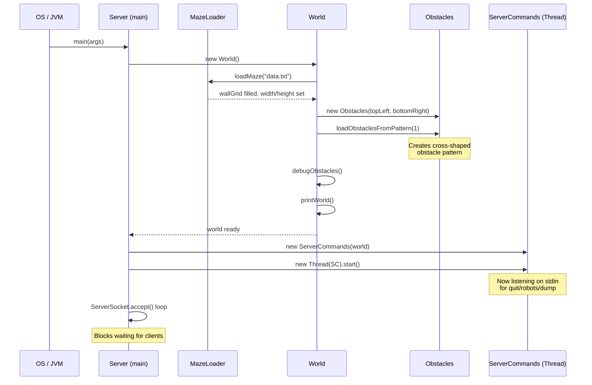
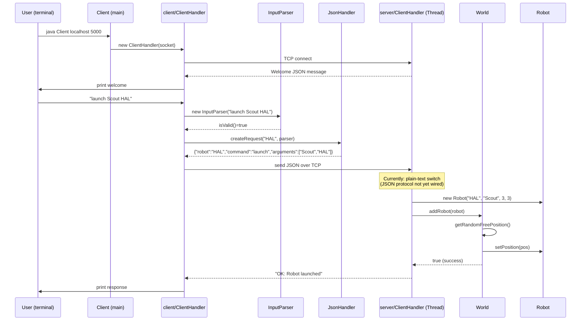
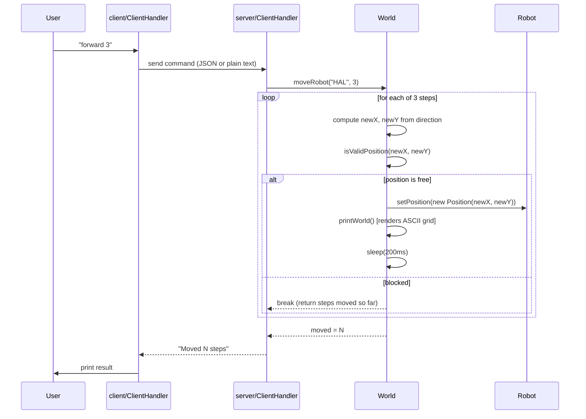
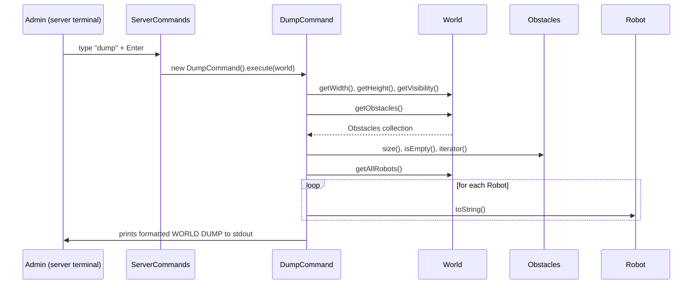
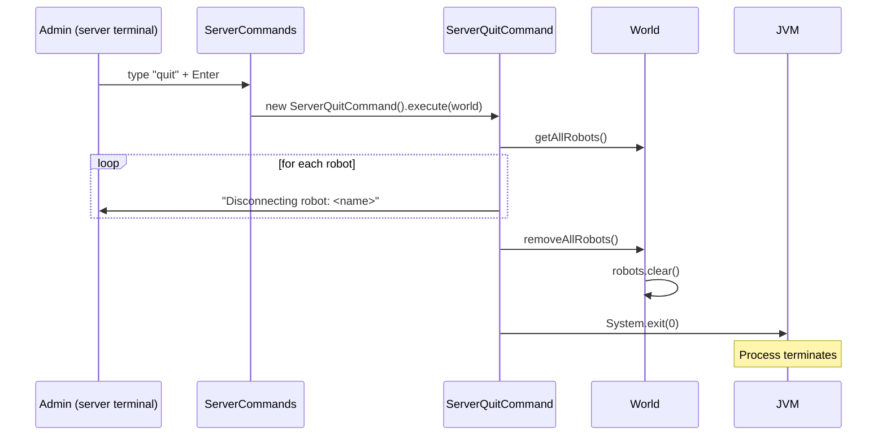
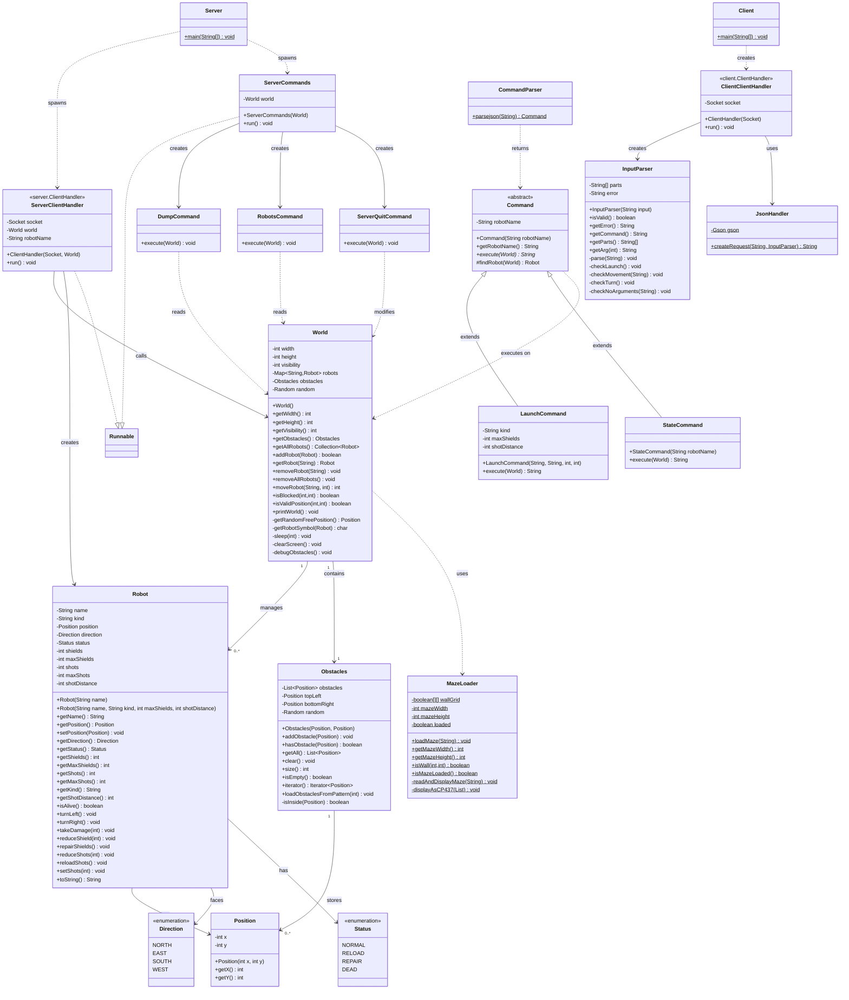

# Robot World — Iteration 1 Technical Documentation

> **Codebase snapshot:** April 2026 — Iteration 1 in progress.

---

## 1 · Package & File Index

```
src/main/java/za/co/wethinkcode/robots/
│
├── api/
│   └── API.java                   ← Empty placeholder (not yet used)
│
├── client/
│   ├── Client.java                ← Entry point: parse host+port, open socket, hand off
│   ├── ClientHandler.java         ← REPL loop: read user input → send JSON → print reply
│   ├── InputParser.java           ← Syntax-only validation of the user's typed command
│   └── JsonHandler.java           ← Serialises a validated InputParser into a JSON string
│
└── server/
    ├── Server.java                ← Entry point: open ServerSocket, spawn threads
    ├── ClientHandler.java         ← One thread per connected client (plain-text protocol)
    ├── Robot.java                 ← Robot entity: position, direction, shields, shots, status
    │
    ├── commands/
    │   ├── Command.java           ← Abstract base: robotName + execute(World) → String
    │   ├── CommandParser.java     ← Stub — parses JSON but always returns null (incomplete)
    │   ├── LaunchCommand.java     ← COMMENTED OUT — exists only as commented skeleton
    │   ├── StateCommand.java      ← COMMENTED OUT — exists only as commented skeleton
    │   ├── DumpCommand.java       ← Server-console: prints world size, obstacles, robots
    │   ├── RobotsCommand.java     ← Server-console: lists all robots with full state
    │   ├── ServerCommands.java    ← Runnable: reads stdin and dispatches quit/robots/dump
    │   └── ServerQuitCommand.java ← Clears robots then calls System.exit(0)
    │
    └── world/
        ├── Direction.java         ← Enum: NORTH, EAST, SOUTH, WEST
        ├── Status.java            ← Enum: NORMAL, RELOAD, REPAIR, DEAD
        ├── Position.java          ← Immutable value object: (x, y) with final fields
        ├── MazeLoader.java        ← Static utility: reads data.txt, builds boolean wallGrid
        ├── Obstacles.java         ← Collection of obstacle Positions with bounds-check
        └── World.java             ← Authoritative game state: robots map, obstacles, grid

src/test/java/za/co/wethinkcode/robots/
    ├── client/
    │   └── InputParserTest.java   ← 40+ unit tests covering all InputParser branches
    └── server/
        ├── DumpCommandTest.java        ← Tests world data that DumpCommand reads
        ├── LaunchCommandTest.java      ← Tests LaunchCommand.execute() (uses commented code)
        ├── RobotsCommandTest.java      ← Tests world.listRobots() method (not yet on World)
        ├── ServerIntegrationTest.java  ← Actually a duplicate of JsonHandler, misnamed
        ├── ServerQuitCommandTest.java  ← Tests removeAllRobots()
        └── StateCommandTest.java       ← Tests StateCommand.execute() (uses commented code)
```

---

## 2 · Design Principles — Where & Why

### 2.1 Encapsulation

**Definition:** Bundle data with the methods that operate on it; expose only what callers need.

**Where it appears:**

| Class | How |
|-------|-----|
| `Robot` | All fields (`name`, `position`, `shields`, `shots`, `status`, `direction`) are `private`. Callers get read access through getters and write access only through behaviour methods like `turnLeft()`, `reduceShield()`, `reloadShots()`. No field can be set to an arbitrary value from outside the class. |
| `World` | The `robots` map, `obstacles`, `width`, and `height` are all `private final`. External code never touches the map directly; it calls `addRobot()`, `getRobot()`, `removeRobot()`, or `moveRobot()`. The internal rendering (`printWorld()`) and sleeping (`sleep()`) are also private. |
| `Obstacles` | The backing `List<Position>` is private. The class exposes a controlled API: `addObstacle()`, `hasObstacle()`, `getAll()`, `size()`, `clear()`. Bounds-checking (`isInside()`) is private — callers cannot bypass it. |
| `InputParser` | The raw `parts[]` array and `error` string are private. Callers use `isValid()`, `getCommand()`, `getArg(n)` — they never see how the parsing works internally. |

**Why it was chosen:** Without encapsulation, any class could corrupt Robot state (e.g., set shields to a negative number) or put two robots on the same cell by writing to the map directly. Encapsulation keeps invariants intact.

---

### 2.2 Polymorphism

**Definition:** Different types respond to the same message (method call) in different ways.

**Where it appears:**

| Mechanism | How |
|-----------|-----|
| `Command` abstract class | `Command` declares `abstract String execute(World world)`. Every concrete command (`LaunchCommand`, `StateCommand`) overrides this. The dispatcher (`ClientHandler` / `ServerCommands`) calls `cmd.execute(world)` without knowing which subclass it is holding. |
| `Direction` enum switch | `Robot.turnLeft()` and `Robot.turnRight()` use `switch` on an enum — Java switch expressions are a form of dispatching by type/value. Each direction "responds" differently to a turn. |
| `getRobotSymbol()` in World | Returns a different char (`^`, `v`, `>`, `<`) depending on `robot.getDirection()` — the direction value determines the visual representation. |
| `Obstacles implements Iterable<Position>` | Implements the `Iterable` interface so it can be used directly in a for-each loop, just like any standard Java collection. |

**Why it was chosen:** The Command pattern (abstract base + concrete subclasses) lets you add a new command (`FireCommand`, `RepairCommand`) without touching the dispatcher. The dispatcher just calls `execute()` on whatever `Command` it receives.

---

### 2.3 Separation of Concerns (SoC)

**Definition:** Each module should address one well-defined concern and not leak into another's territory.

**How the codebase is divided:**

```
Concern                         → Class(es) responsible
─────────────────────────────────────────────────────────
Network I/O (accept connections) → Server.java
Per-client session management    → server/ClientHandler.java
Game rules & world state         → World.java
Robot entity data                → Robot.java
Obstacle storage                 → Obstacles.java
Maze file loading                → MazeLoader.java
Server-console command dispatch  → ServerCommands.java
Server-console quit behaviour    → ServerQuitCommand.java
World dump output                → DumpCommand.java
Robot listing output             → RobotsCommand.java
Client network session           → client/ClientHandler.java
User input syntax checking       → InputParser.java
JSON serialisation               → JsonHandler.java
```

**Example in practice:** `InputParser` only checks *syntax* — it never talks to the server or checks whether a move is legal. The server is responsible for legality. This is an explicit design decision stated in the class's own Javadoc comment.

**Why it was chosen:** If the JSON format changes, only `JsonHandler` needs updating. If the maze file format changes, only `MazeLoader` changes. Teams can work in parallel without constantly conflicting.

---

### 2.4 Single Responsibility Principle (SRP)

**Definition:** A class should have one, and only one, reason to change.

**Where it is followed:**

| Class | Single reason to change |
|-------|------------------------|
| `MazeLoader` | The maze file format changes |
| `InputParser` | The set of valid client commands changes |
| `JsonHandler` | The JSON protocol schema changes |
| `Direction` | The set of compass directions changes |
| `Status` | The set of robot status values changes |
| `ServerQuitCommand` | The shutdown behaviour changes |

**Where SRP is under pressure (honest assessment):**

- **`server/ClientHandler.java`** handles the network session *and* parses the command string *and* executes game logic all in one `switch` block. This is the most significant SRP violation in the codebase. The intended fix is to route commands through `CommandParser` → `Command.execute()` — but `CommandParser` is not fully implemented yet.
- **`World.java`** manages game state *and* renders the ASCII grid to stdout. Rendering should ideally be a separate `WorldRenderer` concern.

---

### 2.5 Immutability

**Definition:** Once an object is created, its state cannot be changed. This makes objects safe to share across threads.

**Where it appears:**

| Class | What is immutable |
|-------|-------------------|
| `Position` | Both fields `x` and `y` are `private final`. There are no setters. Every time a robot moves, a *new* `Position` is created — the old one is discarded. This is the canonical immutable value-object pattern. |
| `Direction` (enum) | Enum constants are immutable by nature. `Direction.NORTH` is always `NORTH`. |
| `Status` (enum) | Same as `Direction`. |
| `World` dimensions | `width` and `height` are `private final` — the world size never changes at runtime. |
| `World.robots` map reference | The map *reference* is `final` (you can't swap in a different map), even though entries can be added/removed. |

**Why immutability matters here:** The server is multi-threaded. Multiple `ClientHandler` threads share the same `World`. Immutable `Position` objects can be passed between threads without synchronisation — you never see a half-written position. (Note: the mutable parts of `World` — the robots map — are not yet synchronised, which is a known gap.)

---

## 3 · Business Logic / Sequence Diagrams

### 3.1 Server Boot Sequence



---

### 3.2 Client Connects & Launches a Robot



---

### 3.3 Robot Moves Forward



---

### 3.4 Server Console — dump Command



---

### 3.5 Server Console — quit Command



---

## 4 · UML Class Diagram



---

## 5 · Iteration 1 Gap Analysis

### ✅ Implemented

| Requirement | Status | Notes |
|-------------|--------|-------|
| World with hard-coded size | ✅ Done | Size comes from `data.txt` via `MazeLoader`. Hard-coded in the sense that it's not configurable at runtime. |
| Hard-coded obstacle | ✅ Done | `Obstacles.loadObstaclesFromPattern(1)` creates a fixed cross-shaped obstacle. |
| `quit` command (server console) | ✅ Done | `ServerQuitCommand` clears robots and calls `System.exit(0)`. |
| `robots` command (server console) | ✅ Done | `RobotsCommand` prints all robots. Note: spec says "list names only" — current impl prints full state. Simplify if required. |
| `dump` command | ✅ Done | `DumpCommand` prints world size, visibility, obstacles, and full robot state. |
| Multiple concurrent client connections | ✅ Done | `Server` spawns a new `Thread(new ClientHandler(...))` per accepted socket. |
| Launch more than one robot | ✅ Partial | `World.addRobot()` supports multiple robots. The client side hardcodes robot name as `"HAL"` — every client would clash. See gap below. |
| `look` command (ignore visibility) | ✅ Partial | `ClientHandler` handles `"look"` by calling `world.printWorld()` to stdout on the server. No look data is sent back to the client yet. |
| `state` command with sensible defaults | ✅ Partial | `ClientHandler` calls `robot.toString()` and sends it. The `StateCommand` class exists but is commented out and not wired to the JSON path. |

---

### ⚠️ Gaps & Blockers

| Gap | Severity | Detail |
|-----|----------|--------|
| **`CommandParser` is a stub** | 🔴 Critical | `CommandParser.parsejson()` always returns `null`. The server `ClientHandler` never calls it — it uses a raw plain-text `switch` instead of JSON. The Command pattern classes are **not connected to the actual request flow**. |
| **`LaunchCommand` and `StateCommand` are commented out** | 🔴 Critical | Both classes exist only as comments. Tests for them reference an API (`World(20,20,5)`, `world.launchRobot()`, `world.listRobots()`) that **does not exist on the current `World` class**. The tests will not compile. |
| **Client hardcodes robot name as `"HAL"`** | 🔴 Critical | Every client robot is named `"HAL"`. If two clients connect, the second `addRobot()` call returns `false` (duplicate name). The robot name should be taken from the `launch` command's argument. |
| **`look` response not sent to client** | 🟡 High | `look` calls `world.printWorld()` which prints to the *server's* stdout. The client receives only `"Look executed"`. No obstacle/robot data is returned to the calling robot. |
| **No JSON protocol on server receive path** | 🟡 High | The client sends well-formed JSON (`JsonHandler`), but `server/ClientHandler` splits on spaces — `input.split(" ")` — so it receives JSON and tries to parse it as plain text. These two halves are mismatched. |
| **`ServerIntegrationTest.java` is misnamed/wrong** | 🟡 High | The file is actually a second copy of `JsonHandler` in the test package. No integration test exists. |
| **`World.removeAllRobots()` calls `printWorld()`** | 🟠 Medium | During shutdown this redraws the grid to stdout after all robots are gone — harmless but noisy. |
| **Thread safety** | 🟠 Medium | Multiple `ClientHandler` threads share `World.robots` (a `HashMap`). Concurrent adds/reads are not synchronised. Use `ConcurrentHashMap` or `synchronized` blocks. |
| **`Position.equals()` not overridden** | 🟠 Medium | `World.isBlocked()` compares positions with `r.getPosition().equals(new Position(x,y))`. Since `Position` does not override `equals()`, this always uses reference equality and will **never match**. A robot occupying a cell does not block it. |
| **`Obstacles.hasObstacle()` same issue** | 🟠 Medium | `obstacles.contains(pos)` also relies on `Position.equals()` — same bug. |
| **`MazeLoader` uses static state** | 🟠 Medium | All fields are static. A second `World` in the same JVM (e.g. in tests) reuses the first load because of the `loaded` flag. Tests that construct `World` will share maze state. |
| **`API.java` is empty** | 🟢 Low | Placeholder class with no content. Fine for now. |
| **`data.txt` path is relative** | 🟢 Low | `MazeLoader` opens `"data.txt"` relative to the working directory. Works when launched from the project root; will fail from other directories. |

---

## 6 · Quick-Reference: How the Threads Work

```
JVM Process
│
├── Thread-0 (main)          → ServerCommands.run() — blocks on Scanner.nextLine()
│                              Handles: quit, robots, dump
│
├── Thread-1 (client-1)      → server/ClientHandler.run() for socket-1
│                              Handles all commands from Robot 1
│
├── Thread-2 (client-2)      → server/ClientHandler.run() for socket-2
│                              Handles all commands from Robot 2
│
└── ... one thread per client
```

All `ClientHandler` threads share **one `World` instance**. Concurrent access to `world.robots` (HashMap) is the current thread-safety gap.

---

## 7 · Priority Fix List Before the Demo

1. **Override `Position.equals()` and `hashCode()`** — without this, obstacle collision and robot collision detection are broken.
2. **Uncomment `LaunchCommand` and `StateCommand`** and wire them through `CommandParser` so the Command pattern actually runs.
3. **Fix the client hardcoded robot name** — read the name from the `launch` argument so multiple clients can each have a unique robot.
4. **Align the protocol** — either make the server parse the JSON it receives (use `CommandParser`), or make the client send plain text. They must agree.
5. **Make `look` return data to the client** — format obstacles and robot positions as a response string, not server-side stdout.
