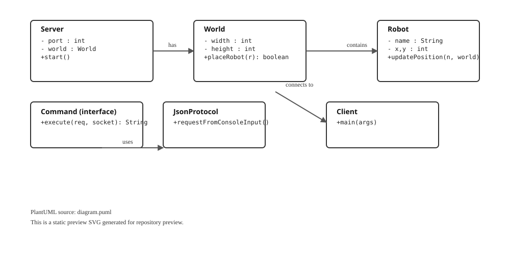

# Toy Robot Worlds

**Toy Robot Worlds** is a multiplayer, client-server simulation game. Connect your robot client to a centralized server, navigate a generated virtual world, avoid obstacles and pits, and engage in combat with other connected robots!

---

## Features

- **Multiplayer Architecture**: A central server manages the world state while multiple clients can connect and issue commands concurrently.
- **Interactive World**: Procedurally generated worlds featuring obstacles (Mountains, Rocks, Lakes) and bottomless pits.
- **Combat System**: Look around, aim, and fire lasers at opponent robots.
- **Graphical Client**: A JavaFX graphical user interface (GUI) for an interactive player experience, alongside a traditional command-line client.

---

## Architecture & Communication

The Toy Robot system uses a standard client-server model communicating over TCP/IP sockets. The client and server communicate by exchanging JSON objects. Each request from the client has an expected response from the server.

### Example Client Request
```json
{
  "robot": "HAL",
  "command": "forward",
  "arguments": ["10"]
}
```

### Example Server Response
```json
{
  "result": "OK",
  "data": {
    "message": "Done"
  },
  "state": {
    "position": [10, 0],
    "direction": "NORTH",
    "shields": 5,
    "shots": 5,
    "status": "NORMAL"
  }
}
```

---

## World Configuration

The virtual world that the robots navigate is configured on the server.
- **World Size**: The world is a square grid. The size is specified by a single integer (e.g. `100` means a `200x200` grid from `-100` to `100`).
- **Obstacles**: Blocks in the world that robots cannot move through. Hitting one stops movement.
- **Pits**: Dangerous tiles. If a robot moves into a pit, it falls in and is destroyed.

---

## Robot Commands Reference

Once a client connects, you must first `launch <robot_name>` into the world. After launching, the following commands are available:

### Movement & Rotation
*   `forward <steps>`: Moves the robot forward.
*   `back <steps>`: Moves the robot backwards.
*   `turn right` / `turn left`: Turns the robot 90 degrees.

### Actions
*   `fire`: Shoots a laser in the current direction. Hits decrease the opponent's shields. Uses 1 shot.
*   `look`: Scans the immediate environment (North, South, East, West) and reports obstacles, boundaries, or other robots.
*   `state`: Requests the current state of the robot (position, direction, shield level, shots).

### Maintenance & System
*   `repair`: Restores the robot's shields to maximum.
*   `reload`: Restores the robot's weapon shots to maximum.
*   `quit`: Disconnects the robot from the server and removes it from the world.

---

## Getting Started

This is a `Java` project built with `Maven`. 

### Repository Structure
* `src/main/java` - Contains the core implementation for both the Client and Server.
* `src/test/java` - Contains the unit tests for the application.
* `docs/` - Contains individual markdown wiki pages.

### IDE Setup (IntelliJ)
To open the project in `IntelliJ IDEA`:
1. **File** -> **New** -> **Project from Existing Sources...**
2. Select the directory where this code has been checked out.
3. Choose **External Model** as **Maven**.

---

## Build, Test & Run

Ensure you are in the root directory of the project. You can compile and test the code using Maven.

**Compile the code:**
```bash
mvn compile
```

**Run the tests:**
```bash
mvn test
```

### Running the Application

**1. Start the Server:**
The server must be running before any clients can connect.
```bash
mvn compile exec:java -Dexec.mainClass="za.co.wethinkcode.robots.server.Server"
```
*(Optional arguments: `-p 5000` for port, `-s 100` for world size).*

**2. Start the Client (CLI):**
Connect a terminal-based client to the server.
```bash
mvn compile exec:java -Dexec.mainClass="za.co.wethinkcode.robots.client.Client"
```

**3. Start the GUI Client:**
Launch the graphical user interface for a rich visual experience.
```bash
mvn compile javafx:run
```
To run the GUI client on a different PC from the server, use the following command:
```bash
mvn compile javafx:run -Dserver.host="<server_ip_address>"
```
Replace `<server_ip_address>` with the IP address of the machine running the server.

---

## UML Diagram

Inline preview of the class diagram is available below (no downloads required).



You can edit the source PlantUML at `diagram.puml` and re-render locally with PlantUML if you want a different layout or more detail.

